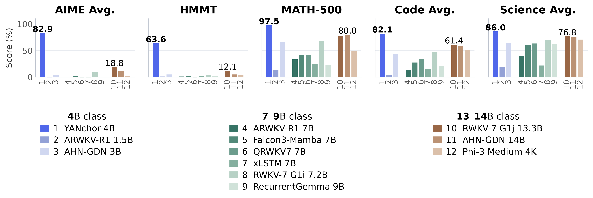
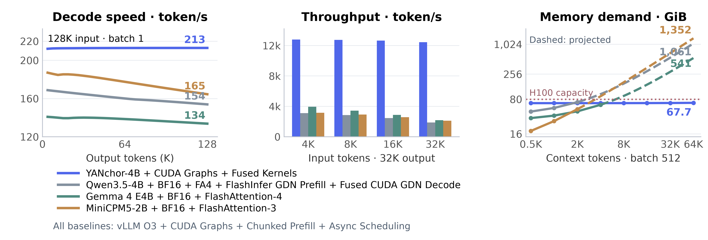
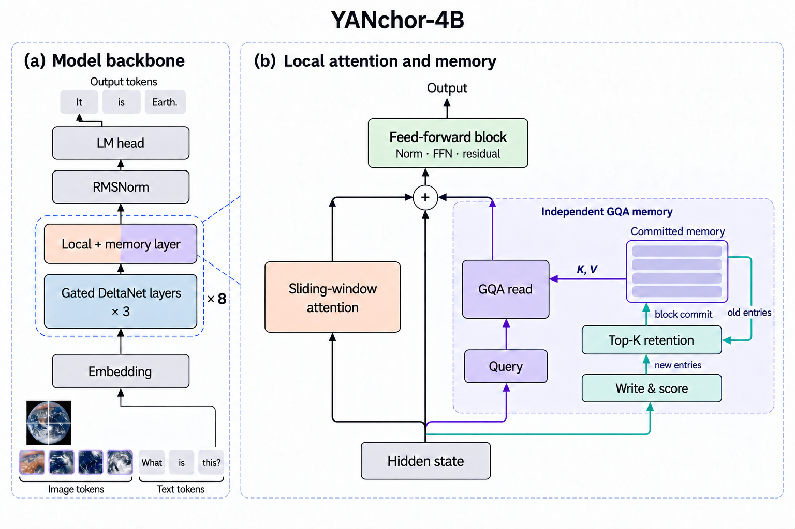
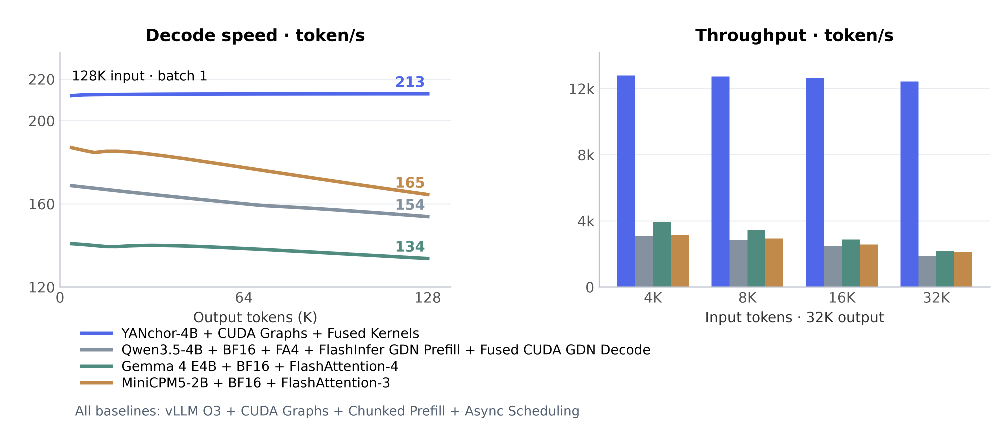
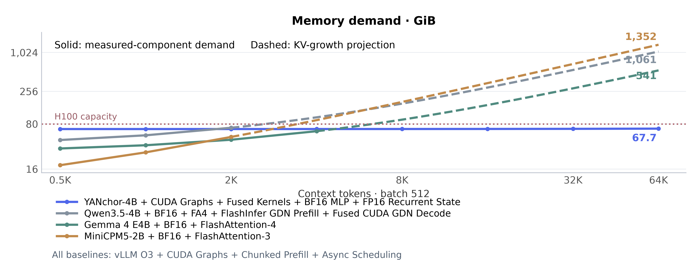

<div align="center">
  <h1>YANchor-4B</h1>
  <h3>Effective Long-Horizon Reasoning<br>in O(N) Time with O(1) Memory</h3>
  <p>Rock Matrix · October 2026 · arXiv:2610.10118</p>
  <p>
    📄 <a href="https://arxiv.org/abs/2610.10118"><b>Technical Report</b></a>
    &nbsp; | &nbsp;
    💻 <a href="https://github.com/rockmatrix-ai/YANchor">GitHub</a>
    &nbsp; | &nbsp;
    🤗 <a href="https://huggingface.co/rockmatrix-ai/YANchor-4B">Hugging Face</a>
    &nbsp; | &nbsp;
    🤖 <a href="https://modelscope.ai/models/RocoreMatrix/YANchor-4B">ModelScope</a>
  </p>
</div>

YANchor-4B is a general-purpose recurrent model that preserves crucial memory as ANchors for retrieval during subsequent reasoning. Its multidimensional memory mechanism enables effective long-horizon reasoning with O(N) generation time and O(1) history-state memory.

For example, on challenging math problems, YANchor achieves 82.9% mean pass@1 on AIME 2024–2026 and 63.6% on HMMT, substantially outperforming linear-time, constant-state counterparts, including 7B–14B models.

YANchor delivers several-fold higher batched long-generation throughput than Transformer and hybrid baselines on H100. Evaluations across dozens of benchmarks demonstrate its superiority in general-purpose capabilities.



AIME averages 2024–2026; HMMT uses February 2026. Code averages HumanEval, MBPP, and LiveCodeBench v6; science averages GPQA-Diamond, ARC-C, and ARC-E. Benchmarks have equal weight within each aggregate. [Evaluation settings](#evaluation-settings).

**Single-H100 inference: speed, throughput, and memory.**



Throughput uses repeated prompts and 32K outputs. Solid memory curves use measured components; dashed curves project KV growth. [Inference settings](#inference-configurations) · [Memory comparison](#gpu-memory).

## Evaluation

Evaluation covers the complete designated splits of 29 common text benchmarks and six VL benchmarks. YANchor reports mean pass@1 for correctness-based tasks; Evaluation Settings defines the metrics. Bold marks row-best scores, including ties.

### Linear-time, constant-state models

YANchor leads all 16 evaluated linear-time, constant-state baselines on 24 of the 29 common benchmarks. Its 29-benchmark mean is **77.2**, exceeding the strongest baseline, AHN-GDN Qwen2.5 14B at 53.4, by **23.8 points**. On AIME and HMMT, YANchor scores 82.9 and 63.6, compared with 18.8 and 12.1 for RWKV-7 G1j 13.3B. The lead spans 7B–14B counterparts and extends to knowledge, code, and instruction following.

| Benchmark | YANchor-4B | ARWKV-R1 7B [[2]](#ref-2) | Falcon3-Mamba 7B Instruct [[4]](#ref-4) | QRWKV7 7B Instruct [[5]](#ref-5) | xLSTM 7B [[6]](#ref-6) | Recurrent Gemma 9B IT [[8]](#ref-8) | RWKV-7 G1j 13.3B [[7]](#ref-7) | AHN-GDN Qwen2.5 14B [[3]](#ref-3) | Phi-3 Medium 4K Instruct W2047 [[9]](#ref-9) |
| --- | ---: | ---: | ---: | ---: | ---: | ---: | ---: | ---: | ---: |
| **Mathematics** |  |  |  |  |  |  |  |  |  |
| AIME 2024 [[12]](#ref-12) | **86.7** | 0.0 | 1.7 | 0.0 | 0.0 | 0.4 | 17.5 | 13.8 | 3.3 |
| AIME 2025 [[12]](#ref-12) | **77.4** | 0.0 | 0.8 | 0.0 | 0.0 | 0.8 | 27.5 | 10.0 | 3.3 |
| AIME 2026 [[12]](#ref-12) | **84.6** | 0.4 | 1.2 | 0.0 | 0.0 | 0.0 | 11.2 | 10.4 | 0.0 |
| HMMT Feb 2025 [[13]](#ref-13) | **71.8** | 0.8 | 0.8 | 0.0 | 1.7 | 1.2 | 3.3 | 7.5 | 6.7 |
| HMMT Nov 2025 [[13]](#ref-13) | **69.8** | 1.7 | 5.4 | 6.7 | 5.0 | 5.4 | 5.8 | 10.0 | 2.5 |
| HMMT Feb 2026 [[13]](#ref-13) | **63.6** | 1.1 | 2.7 | 0.0 | 1.5 | 1.9 | 12.1 | 4.9 | 3.0 |
| MATH-500 [[11]](#ref-11) | **97.5** | 33.2 | 41.8 | 41.0 | 25.0 | 22.8 | 77.2 | 80.0 | 49.0 |
| GSM8K [[10]](#ref-10) | 94.5 | 51.2 | 61.4 | 65.5 | 43.4 | 51.7 | **94.6** | 93.6 | 85.3 |
| **Knowledge** |  |  |  |  |  |  |  |  |  |
| MMLU [[14]](#ref-14) | **88.2** | 32.3 | 57.7 | 64.6 | 19.6 | 55.5 | 76.7 | 77.2 | 76.3 |
| MMLU-Pro [[15]](#ref-15) | **79.8** | 8.8 | 26.1 | 23.0 | 4.6 | 13.4 | 47.6 | 63.5 | 54.0 |
| MMLU-Redux [[16]](#ref-16) | **92.0** | 35.2 | 64.8 | 34.1 | 37.9 | 55.0 | 81.8 | 83.5 | 81.4 |
| CMMLU [[17]](#ref-17) | 73.3 | 29.0 | 33.4 | 57.7 | 16.9 | 43.4 | 67.4 | **75.0** | 53.3 |
| C-Eval [[18]](#ref-18) | **74.6** | 29.0 | 35.2 | 56.0 | 19.5 | 41.7 | 66.3 | 74.2 | 51.3 |
| **Science** |  |  |  |  |  |  |  |  |  |
| GPQA-Diamond [[19]](#ref-19) | **64.6** | 13.1 | 20.7 | 8.6 | 12.1 | 24.7 | 42.4 | 40.9 | 26.8 |
| SuperGPQA [[20]](#ref-20) | **60.0** | 8.8 | 12.2 | 15.4 | 5.3 | 19.5 | 31.8 | 35.5 | 25.6 |
| ARC-C [[23]](#ref-23) | **95.5** | 47.4 | 74.8 | 86.3 | 25.1 | 73.3 | 91.8 | 91.5 | 89.8 |
| ARC-E [[23]](#ref-23) | **98.0** | 56.8 | 87.6 | 95.4 | 28.2 | 87.2 | 96.3 | 94.0 | 95.3 |
| **Commonsense and reasoning** |  |  |  |  |  |  |  |  |  |
| WinoGrande [[21]](#ref-21) | 77.9 | 34.4 | 57.5 | 61.8 | 28.3 | 56.4 | 72.1 | 74.0 | **79.6** |
| HellaSwag [[22]](#ref-22) | 64.9 | 10.0 | 38.6 | 48.0 | 7.9 | 45.8 | **77.4** | 67.9 | 74.0 |
| BBH [[24]](#ref-24) | **85.4** | 16.6 | 32.8 | 37.4 | 12.8 | 35.5 | 48.7 | 52.0 | 53.3 |
| BBEH [[25]](#ref-25) | **28.9** | 2.4 | 3.4 | 1.9 | 3.3 | 3.2 | 7.7 | 5.3 | 3.1 |
| DROP F1 [[31]](#ref-31) | **77.2** | 11.1 | 19.9 | 21.2 | 29.0 | 37.1 | 51.5 | 66.5 | 51.5 |
| MuSR [[32]](#ref-32) | **60.4** | 15.4 | 29.1 | 2.6 | 19.3 | 35.2 | 51.4 | 56.4 | 51.1 |
| LogiQA2 [[33]](#ref-33) | 72.2 | 26.8 | 41.4 | 33.2 | 20.0 | 40.2 | 66.6 | **72.3** | 62.7 |
| **Code** |  |  |  |  |  |  |  |  |  |
| HumanEval [[26]](#ref-26) | **96.7** | 16.5 | 34.1 | 62.2 | 36.6 | 37.2 | 86.0 | 75.6 | 73.8 |
| MBPP [[27]](#ref-27) | **87.8** | 21.2 | 39.2 | 30.2 | 9.2 | 19.0 | 67.4 | 68.6 | 59.4 |
| LiveCodeBench v6 [[28]](#ref-28) | **61.6** | 2.6 | 9.3 | 12.4 | 2.2 | 7.9 | 30.7 | 32.9 | 19.1 |
| **Instruction following** |  |  |  |  |  |  |  |  |  |
| IFEval [[29]](#ref-29) | **88.0** | 10.4 | 64.7 | 59.0 | 34.0 | 39.7 | 77.8 | 77.4 | 61.4 |
| IFBench [[30]](#ref-30) | **65.3** | 8.3 | 18.7 | 21.3 | 14.7 | 12.7 | 27.3 | 33.3 | 22.0 |
| **29-benchmark mean** | **77.2** | 18.1 | 31.6 | 32.6 | 16.0 | 29.9 | 52.3 | 53.4 | 45.4 |

## Model

| Model | Text parameters | Weights | Model license |
|---|---:|---|---|
| YANchor-4B | 4.58B | [Hugging Face](https://huggingface.co/rockmatrix-ai/YANchor-4B) | [YANchor Model License 1.0](MODEL_LICENSE) |

### Architecture



Long-horizon reasoning needs access to crucial information after it leaves the local context. YANchor preserves this information as persistent memory anchors, making distant context available for retrieval during subsequent reasoning.

YANchor retains Qwen3.5-4B's recurrent layers and replaces its global-attention positions with local attention and independent memory. Three complementary paths carry earlier constraints, intermediate results, and exact associations.

| Information path | Role |
|---|---|
| Gated DeltaNet | Maintains a fixed-size recurrent summary of history. |
| Sliding-window attention | Resolves detailed interactions among recent tokens. |
| Independent GQA memory | Learns what to write, which records to retain, and how to retrieve distant information. |

The memory has independent writing, admission, and retrieval parameters. New records compete with retained entries through blockwise Top-K selection, which preserves the written key–value representations of the retained records. Current queries read these memory anchors through grouped-query attention. Local and memory attention are normalized separately, and their outputs join the residual stream.

The recurrent state, local window, memory bank, candidate records, and metadata have fixed capacity. YANchor therefore generates N tokens in O(N) time using O(1) history-state memory.

## Inference efficiency

Fixed-capacity history supports sustained decoding and larger active batches. All comparisons use one H100 80GB.

**Single-sequence speed.** YANchor sustains 212.98 cumulative decode tokens/s at 128K input + 128K output; Qwen3.5-4B, Gemma 4 E4B, and MiniCPM5-2B reach 153.91, 133.75, and 164.53 tokens/s, respectively. YANchor's curve remains nearly flat as generation extends.

**Batched throughput.** YANchor delivers 5.66–6.58 times the throughput of Gemma, MiniCPM, and Qwen at 32K input + 32K output. It reaches 12,431 end-to-end tokens/s, compared with 2,196, 2,117, and 1,889, respectively.



### Inference configurations

Tests use synthetic token inputs and fixed-length generation with EOS ignored; tokenizer and text-decoding costs are excluded. Batch tests use repeated prompts with independent continuation states. Batch candidates are 32–512 for YANchor, 64/128 for Gemma, and 32/64 for Qwen and MiniCPM; the comparison reports each model's highest measured throughput. Tensor-parallel size is one. Pure decode is timed after first-token delivery; end-to-end throughput covers the complete generation call, including prefill, queueing, scheduling, and cache-preemption recomputation. Loading and warmup are outside both intervals. Here 1K is 1,024 tokens.

YANchor uses CUDA Graphs and fused kernels, with INT8 MLP / FP32 recurrent state at B1 and BF16 MLP / FP16 recurrent state in batch tests. Qwen uses BF16, FlashAttention-4, FlashInfer GDN prefill, and fused CUDA GDN decode. Gemma uses BF16 and full-layer FlashAttention-4; MiniCPM uses BF16 and FlashAttention-3. All three baselines enable vLLM O3, CUDA Graphs, chunked prefill, and asynchronous scheduling.

Gemma and MiniCPM extend runtime and position-table capacity to 256K for the B1 speed measurement, keeping weights and RoPE frequencies unchanged. Deployment references: [Gemma/vLLM](https://docs.vllm.ai/projects/recipes/en/stable/Google/Gemma4.html), [MiniCPM5](https://huggingface.co/openbmb/MiniCPM5-2B#quickstart).

## GPU memory

YANchor keeps 512 independent long-context sequences resident on one H100 80GB. Its history cache stays fixed at 48.90 GiB as context grows from 512 to 65,536 tokens per sequence. Peak memory demand remains near 67 GiB; the 1 GiB increase comes from input buffers.



Each sequence retains an independent history. Solid curves reconstruct peak demand from measured occupied cache, workspace, and runtime overhead, excluding unused preallocated cache. Dashed curves project full-batch demand from the last successful point. The device has 79.65 GiB of memory.

Cache preemption begins at 4K context for Qwen and MiniCPM, and at 8K for Gemma. Their projected demands at 64K are 1,061, 1,352, and 541 GiB, respectively. YANchor's fixed history storage enables the longer contexts and larger active batches that drive its throughput.

## Long-memory capability

YANchor retrieves and uses distant information with 94.1% query accuracy over 16K–130,000-token contexts. The tasks cover exact retrieval, state updates, cross-document combination, and variable binding.

| Memory path | Query accuracy | All four answers correct |
|---|---:|---:|
| Enabled | 94.1% | 80.1% |
| Disabled | 0.4% | 0.0% |

Disabling memory reduces query accuracy to 0.4%. Paired evidence-change tests further show that YANchor uses distant content to update its answers. The technical report gives the task breakdown and experimental settings.

## Transformer and global-attention hybrid references

These models provide cross-architecture references with context-dependent history storage. Qwen3.5-4B combines Gated DeltaNet with global attention and serves as the backbone reference for YANchor’s conversion to bounded-state inference.

YANchor surpasses MiniCPM4.1-8B, Gemma4-E4B, Phi-4-mini-reasoning, and Nemotron-3-Nano-4B on all three AIME editions while using constant history-state memory. Compared with Qwen3.5-4B, YANchor scores higher on MMLU, MMLU-Pro, MMLU-Redux, SuperGPQA, HumanEval, MBPP, IFBench, and DROP. YANchor retains 96.3% of Qwen’s three-year AIME mean and delivers 4.12–6.58 times its measured end-to-end throughput in batched long generation.

| Benchmark | YANchor-4B | Qwen3.5-4B Backbone [[1]](#ref-1) | Granite4.2 3B [[41]](#ref-41) | Phi-4-mini-reasoning [[42]](#ref-42) | Gemma4 E4B-it [[40]](#ref-40) | Nemotron-3 Nano-4B [[43]](#ref-43) | MiniCPM4.1 8B [[39]](#ref-39) |
| --- | ---: | ---: | ---: | ---: | ---: | ---: | ---: |
| **Mathematics** |  |  |  |  |  |  |  |
| AIME 2024 [[12]](#ref-12) | 86.7 | **89.6** | 85.0 | 45.4 | 42.1 | 60.8 | 77.1 |
| AIME 2025 [[12]](#ref-12) | 77.4 | **80.8** | 78.8 | 32.5 | 40.0 | 56.7 | 70.0 |
| AIME 2026 [[12]](#ref-12) | 84.6 | **87.9** | 82.9 | 38.8 | 38.3 | 53.8 | 70.8 |
| HMMT Feb 2025 [[13]](#ref-13) | 71.8 | 74.6 | **75.8** | 25.0 | 25.4 | 40.0 | 58.3 |
| HMMT Nov 2025 [[13]](#ref-13) | 69.8 | **78.3** | 72.5 | 28.7 | 32.9 | 47.1 | 59.6 |
| HMMT Feb 2026 [[13]](#ref-13) | 63.6 | **65.9** | 59.5 | 24.6 | 28.8 | 36.4 | 49.2 |
| MATH-500 [[11]](#ref-11) | 97.5 | **98.0** | 97.8 | 91.6 | 88.2 | 94.8 | 96.4 |
| GSM8K [[10]](#ref-10) | 94.5 | **94.8** | 93.8 | 93.6 | 91.3 | 92.4 | 93.6 |
| **Knowledge** |  |  |  |  |  |  |  |
| MMLU [[14]](#ref-14) | **88.2** | 85.2 | 77.2 | 77.5 | 81.2 | 75.8 | 82.7 |
| MMLU-Pro [[15]](#ref-15) | **79.8** | 77.7 | 66.4 | 38.5 | 69.0 | 56.8 | 67.0 |
| MMLU-Redux [[16]](#ref-16) | **92.0** | 89.8 | 81.6 | 78.3 | 86.4 | 81.5 | 87.8 |
| CMMLU [[17]](#ref-17) | 73.3 | **83.9** | 59.1 | 45.3 | 68.7 | 54.6 | 80.2 |
| C-Eval [[18]](#ref-18) | 74.6 | **84.0** | 60.8 | 42.4 | 68.6 | 56.4 | 79.0 |
| **Science** |  |  |  |  |  |  |  |
| GPQA-Diamond [[19]](#ref-19) | 64.6 | **77.3** | 58.6 | 48.0 | 55.6 | 43.4 | 51.5 |
| SuperGPQA [[20]](#ref-20) | **60.0** | 52.8 | 39.5 | 32.2 | 41.1 | 37.4 | 40.6 |
| ARC-C [[23]](#ref-23) | 95.5 | **96.8** | 92.4 | 90.2 | 94.3 | 91.9 | 93.4 |
| ARC-E [[23]](#ref-23) | 98.0 | **98.4** | 97.1 | 94.4 | 97.7 | 96.7 | 97.4 |
| **Commonsense and reasoning** |  |  |  |  |  |  |  |
| WinoGrande [[21]](#ref-21) | 77.9 | **87.1** | 74.0 | 75.8 | 76.5 | 65.6 | 78.2 |
| HellaSwag [[22]](#ref-22) | 64.9 | **80.6** | 67.4 | 62.6 | 53.5 | 46.3 | 49.8 |
| BBH [[24]](#ref-24) | 85.4 | 86.2 | 85.5 | 72.5 | 84.1 | 79.3 | **86.6** |
| BBEH [[25]](#ref-25) | 28.9 | **34.6** | 24.5 | 12.9 | 17.4 | 10.8 | 14.0 |
| DROP F1 [[31]](#ref-31) | 77.2 | 76.0 | **83.7** | 50.6 | 72.9 | 72.6 | 78.3 |
| MuSR [[32]](#ref-32) | 60.4 | 64.9 | **65.1** | 56.7 | 62.2 | 58.2 | 64.5 |
| LogiQA2 [[33]](#ref-33) | 72.2 | **82.2** | 69.5 | 58.5 | 72.6 | 67.9 | 75.7 |
| **Code** |  |  |  |  |  |  |  |
| HumanEval [[26]](#ref-26) | 96.7 | 86.0 | 97.0 | 79.9 | 93.9 | 90.9 | **98.2** |
| MBPP [[27]](#ref-27) | 87.8 | 71.0 | **92.6** | 64.0 | 79.2 | 72.2 | 92.2 |
| LiveCodeBench v6 [[28]](#ref-28) | 61.6 | 75.7 | **75.9** | 35.3 | 69.1 | 66.4 | 70.4 |
| **Instruction following** |  |  |  |  |  |  |  |
| IFEval [[29]](#ref-29) | 88.0 | 89.6 | **92.2** | 45.7 | 84.3 | 89.5 | 73.4 |
| IFBench [[30]](#ref-30) | 65.3 | 60.3 | **74.3** | 14.3 | 34.7 | 57.7 | 23.7 |

## VL comparison

YANchor supports bilingual VL question answering, object-presence judgments, visual perception, chart understanding, and scientific-diagram reasoning.

| Benchmark | YANchor-4B | Qwen3.5-4B [[1]](#ref-1) |
| --- | ---: | ---: |
| **Vision-language** |  |  |
| MMBench EN [[34]](#ref-34) | 88.3 | **90.1** |
| MMBench CN [[34]](#ref-34) | 89.0 | **91.4** |
| POPE [[35]](#ref-35) | 85.4 | **88.8** |
| MME [[36]](#ref-36) | 83.0 | **86.8** |
| ChartQA [[37]](#ref-37) | 83.9 | **90.3** |
| AI2D [[38]](#ref-38) | 80.0 | **87.0** |

VL scores are answer-level accuracy in percent.

## Evaluation Settings

**YANchor mean pass@1.** For text evaluation, YANchor sets the number of independent responses per item, K, by evaluation-set size: K=64 for fewer than 100 questions, K=16 for 100–10,000 questions, and K=1 for more than 10,000 questions. More repetitions on smaller sets reduce variation from stochastic generation. Binary-correctness scores average across responses and then across problems, estimating single-response success. Other metrics retain their benchmark-specific definitions.

**Scoring.** All text results use the v43 answer-verification rules. IFEval and IFBench fix the language-detector seed to 0. Mathematics uses final-answer correctness. YANchor's code scores count extracted programs that pass the task tests, including code recovered from the end of reasoning. Knowledge and instruction-following tasks use their benchmark-specific aggregation and checkers.

### Generation settings

YANchor's text evaluation uses temperature 0.6, top-p 0.95, top-k 20, and a 131,072-token response budget. VL evaluation uses one response per input with thinking enabled, temperature 1.0, top-p 0.95, top-k 20, presence penalty 1.5, and a 32,768-token response cap.

## Quickstart

### Environment

The released runtime is validated on **NVIDIA H100 80 GB with Linux**. Use Docker with NVIDIA Container Toolkit and the supplied `Dockerfile`, based on `nvcr.io/nvidia/pytorch:26.03-py3`. The image supplies PyTorch, CUDA and FlashAttention; the remaining dependencies, including the pinned public Transformers wheel, are included or specified in the bundle.

YANchor-4B uses the custom inference runtime provided through **`run.py`**. Use this entrypoint to load the model and its memory modules.

### Download and run

Download the complete [Hugging Face bundle](https://huggingface.co/rockmatrix-ai/YANchor-4B), which includes the model weights, runtime and evaluation data. The bundle is also available on [ModelScope](https://modelscope.ai/models/RocoreMatrix/YANchor-4B).

```bash
python -m pip install -U huggingface_hub
hf download rockmatrix-ai/YANchor-4B --local-dir YANchor-4B
cd YANchor-4B
docker build -t yanchor-runtime .
docker run --rm --gpus all --ipc=host -v "$PWD:/model" \
  yanchor-runtime demo --prompt 'Compute 17 × 23.'
```

Run the commands below from the downloaded bundle root. First startup includes weight loading and CUDA compilation. See [the usage guide](USAGE.md) for dependency installation and additional examples.

## Deployment

Start a local B1 HTTP service with the fastest released inference profile:

```bash
docker run --rm --gpus all --ipc=host --network host -v "$PWD:/model" \
  yanchor-runtime serve --batch 1 --profile fast --port 8000
```

The service prewarms its short-input decode path before reporting READY. Batch generation uses the same runtime:

```bash
docker run --rm --gpus all --ipc=host -v "$PWD:/model" \
  yanchor-runtime generate --batch 320 --profile fast \
  --input prompts.jsonl --output outputs/generated
```

`prompts.jsonl` contains one `{"prompt":"..."}` object per line. Supported per-GPU batch capacities are **1, 32, 64, 128, 256, 320 and 512**. The `fast` profile uses INT8 MLP GEMV with FP32 GDN state for B1, and BF16 MLPs with FP16 GDN state for B32–B512. `--profile reference` selects the reference arithmetic. Weights on disk remain BF16. Model loading, prefill and pure decode timings are reported separately.

See [deployment and benchmarking](USAGE.md#demo-and-batch-inference) for request formats, all batch configurations and fixed-work throughput measurements.

## Running the evaluations

The complete model bundle includes all **113,743 questions across the designated evaluation splits of 29 text benchmarks**, together with the scoring code. By default, the evaluator runs every question in each source, with no per-source question limit. The following command uses one H100; expand `--gpus` to a comma-separated list to use more GPUs:

```bash
docker run --rm --gpus all --ipc=host -v "$PWD:/model" \
  yanchor-runtime evaluate --suite text --gpus 0 --batch 320 --output outputs/text
```

Automatic K uses each bundled source's question count: **K=64** below 100 questions, **K=16** for 100–10,000, and **K=1** above 10,000. The defaults apply the text generation settings above and the **v43** scoring rules. Source scores use all question × K attempts and retain benchmark-specific aggregation.

Monitor progress and aggregate decode throughput from another terminal:

```bash
docker run --rm -v "$PWD:/model" yanchor-runtime status --output outputs/text
```

See [evaluation instructions](USAGE.md#evaluation) for text, vision and the four reported memory tasks, source selection, scoring rules and result files.

## License

YANchor-4B weights use [YANchor Model License 1.0](MODEL_LICENSE), a custom license incorporating Apache License 2.0 terms. The sole additional restriction is physically hardwiring covered weights into a chip's non-reprogrammable structure, including commissioning such fabrication, without written authorization. Research, training, fine-tuning, distillation, quantization, deployment, redistribution and commercial use are permitted without fees or scale thresholds. Ordinary device deployment, model-data storage and hardware design remain permitted; read-only storage alone does not trigger the restriction. Code uses [Apache-2.0](LICENSE). Upstream and third-party materials retain their original licenses; see [NOTICE](NOTICE).

## Citation

```bibtex
@misc{yanchor2026,
  title  = {{YANchor-4B}: Effective Long-Horizon Reasoning in {O(N)} Time with {O(1)} Memory},
  author = {Ji, Huishan and Xu, Hua and Zhang, Weiming and Ye, Qirui},
  year   = {2026},
  eprint = {2610.10118},
  archivePrefix = {arXiv},
  primaryClass = {cs.LG},
  url    = {https://arxiv.org/abs/2610.10118}
}
```

Please cite the [technical report, arXiv:2610.10118](https://arxiv.org/abs/2610.10118). Machine-readable metadata is available in [CITATION.cff](CITATION.cff).

### Contacts

Huishan Ji · [jihs@stonehill-tech.com](mailto:jihs@stonehill-tech.com)

Hua Xu · [xuh@stonehill-tech.com](mailto:xuh@stonehill-tech.com)

Weiming Zhang · [zhangwm@stonehill-tech.com](mailto:zhangwm@stonehill-tech.com)

Qirui Ye · [qiruiy@andrew.cmu.edu](mailto:qiruiy@andrew.cmu.edu)

## Acknowledgments

YANchor builds on [Qwen3.5](https://github.com/QwenLM/Qwen3.5) and [Gated DeltaNet](https://arxiv.org/abs/2412.06464). We thank the teams behind the comparison models and evaluation benchmarks.

## References

<a id="ref-1"></a>
[1] Qwen Team. Qwen3.5-4B. Model card. <https://huggingface.co/Qwen/Qwen3.5-4B>, 2026.

<a id="ref-2"></a>
[2] RWKV Red Team. ARWKV-R1-7B. Model release. <https://huggingface.co/RWKV-Red-Team/ARWKV-R1-7B>, 2025.

<a id="ref-3"></a>
[3] Y. Fang et al. Artificial Hippocampus Networks for Efficient Long-Context Modeling. <https://arxiv.org/abs/2510.07318>, 2025.

<a id="ref-4"></a>
[4] Technology Innovation Institute. Falcon3-Mamba-7B-Instruct. <https://huggingface.co/tiiuae/Falcon3-Mamba-7B-Instruct>, 2024.

<a id="ref-5"></a>
[5] D. Goldstein, E. Alcaide, J. Lu, and E. Cheah. RADLADS: Rapid Attention Distillation to Linear Attention Decoders at Scale. <https://arxiv.org/abs/2505.03005>, 2025.

<a id="ref-6"></a>
[6] M. Beck et al. xLSTM 7B: A Recurrent LLM for Fast and Efficient Inference. <https://arxiv.org/abs/2503.13427>, 2025.

<a id="ref-7"></a>
[7] RWKV Project. RWKV-7 G1 model releases. <https://huggingface.co/BlinkDL/rwkv7-g1>, 2026.

<a id="ref-8"></a>
[8] A. Botev et al. RecurrentGemma: Moving Past Transformers for Efficient Open Language Models. <https://arxiv.org/abs/2404.07839>, 2024.

<a id="ref-9"></a>
[9] Microsoft. Phi-3 Medium 4K Instruct. Released model configuration. <https://huggingface.co/microsoft/Phi-3-medium-4k-instruct/blob/main/config.json>, 2024.

<a id="ref-10"></a>
[10] K. Cobbe et al. Training Verifiers to Solve Math Word Problems. <https://arxiv.org/abs/2110.14168>, 2021.

<a id="ref-11"></a>
[11] H. Lightman et al. Let's Verify Step by Step. <https://arxiv.org/abs/2305.20050>, 2023.

<a id="ref-12"></a>
[12] Mathematical Association of America. American Invitational Mathematics Examination. <https://maa.org/maa-invitational-competitions/>.

<a id="ref-13"></a>
[13] Harvard-MIT Mathematics Tournament. Past Tournaments. <https://www.hmmt.org/www/archive/results>.

<a id="ref-14"></a>
[14] D. Hendrycks et al. Measuring Massive Multitask Language Understanding. <https://arxiv.org/abs/2009.03300>, 2020.

<a id="ref-15"></a>
[15] Y. Wang et al. MMLU-Pro: A More Robust and Challenging Multi-Task Language Understanding Benchmark. <https://arxiv.org/abs/2406.01574>, 2024.

<a id="ref-16"></a>
[16] A. P. Gema et al. Are We Done with MMLU? <https://arxiv.org/abs/2406.04127>, 2024.

<a id="ref-17"></a>
[17] H. Li et al. CMMLU: Measuring Massive Multitask Language Understanding in Chinese. <https://arxiv.org/abs/2306.09212>, 2023.

<a id="ref-18"></a>
[18] Y. Huang et al. C-Eval: A Multi-Level Multi-Discipline Chinese Evaluation Suite for Foundation Models. <https://arxiv.org/abs/2305.08322>, 2023.

<a id="ref-19"></a>
[19] D. Rein et al. GPQA: A Graduate-Level Google-Proof Q&A Benchmark. <https://arxiv.org/abs/2311.12022>, 2023.

<a id="ref-20"></a>
[20] M-A-P Team et al. SuperGPQA: Scaling LLM Evaluation across 285 Graduate Disciplines. <https://arxiv.org/abs/2502.14739>, 2025.

<a id="ref-21"></a>
[21] K. Sakaguchi et al. WinoGrande: An Adversarial Winograd Schema Challenge at Scale. <https://arxiv.org/abs/1907.10641>, 2019.

<a id="ref-22"></a>
[22] R. Zellers et al. HellaSwag: Can a Machine Really Finish Your Sentence? <https://arxiv.org/abs/1905.07830>, 2019.

<a id="ref-23"></a>
[23] P. Clark et al. Think You Have Solved Question Answering? Try ARC, the AI2 Reasoning Challenge. <https://arxiv.org/abs/1803.05457>, 2018.

<a id="ref-24"></a>
[24] M. Suzgun et al. Challenging BIG-Bench Tasks and Whether Chain-of-Thought Can Solve Them. <https://arxiv.org/abs/2210.09261>, 2022.

<a id="ref-25"></a>
[25] M. Kazemi et al. BIG-Bench Extra Hard. <https://arxiv.org/abs/2502.19187>, 2025.

<a id="ref-26"></a>
[26] M. Chen et al. Evaluating Large Language Models Trained on Code. <https://arxiv.org/abs/2107.03374>, 2021.

<a id="ref-27"></a>
[27] J. Austin et al. Program Synthesis with Large Language Models. <https://arxiv.org/abs/2108.07732>, 2021.

<a id="ref-28"></a>
[28] N. Jain et al. LiveCodeBench. Benchmark repository, release v6. <https://github.com/LiveCodeBench/LiveCodeBench>, 2025.

<a id="ref-29"></a>
[29] J. Zhou et al. Instruction-Following Evaluation for Large Language Models. <https://arxiv.org/abs/2311.07911>, 2023.

<a id="ref-30"></a>
[30] V. Pyatkin et al. Generalizing Verifiable Instruction Following. <https://arxiv.org/abs/2507.02833>, 2025.

<a id="ref-31"></a>
[31] D. Dua et al. DROP: A Reading Comprehension Benchmark Requiring Discrete Reasoning Over Paragraphs. <https://arxiv.org/abs/1903.00161>, 2019.

<a id="ref-32"></a>
[32] Z. Sprague et al. MuSR: Testing the Limits of Chain-of-Thought with Multistep Soft Reasoning. <https://arxiv.org/abs/2310.16049>, 2023.

<a id="ref-33"></a>
[33] H. Liu et al. LogiQA 2.0: An Improved Dataset for Logical Reasoning in Natural Language Understanding. <https://github.com/csitfun/LogiQA2.0>, 2023.

<a id="ref-34"></a>
[34] Y. Liu et al. MMBench: Is Your Multi-modal Model an All-around Player? <https://arxiv.org/abs/2307.06281>, 2023.

<a id="ref-35"></a>
[35] Y. Li et al. Evaluating Object Hallucination in Large Vision-Language Models. <https://arxiv.org/abs/2305.10355>, 2023.

<a id="ref-36"></a>
[36] C. Fu et al. MME: A Comprehensive Evaluation Benchmark for Multimodal Large Language Models. <https://arxiv.org/abs/2306.13394>, 2023.

<a id="ref-37"></a>
[37] A. Masry et al. ChartQA: A Benchmark for Question Answering about Charts with Visual and Logical Reasoning. <https://arxiv.org/abs/2203.10244>, 2022.

<a id="ref-38"></a>
[38] A. Kembhavi et al. A Diagram Is Worth a Dozen Images. <https://arxiv.org/abs/1603.07396>, 2016.

<a id="ref-39"></a>
[39] OpenBMB. MiniCPM4.1-8B. Model card. <https://huggingface.co/openbmb/MiniCPM4.1-8B>, 2025.

<a id="ref-40"></a>
[40] Google. Gemma 4 E4B. Model card. <https://huggingface.co/google/gemma-4-E4B-it>, 2026.

<a id="ref-41"></a>
[41] IBM. Granite 4.2 3B. Model card. <https://huggingface.co/ibm-granite/granite-4.2-3b>, 2026.

<a id="ref-42"></a>
[42] Microsoft. Phi-4-mini-reasoning. Model card. <https://huggingface.co/microsoft/Phi-4-mini-reasoning>, 2025.

<a id="ref-43"></a>
[43] NVIDIA. Nemotron 3 Nano 4B. Model card. <https://huggingface.co/nvidia/NVIDIA-Nemotron-3-Nano-4B-BF16>, 2026.
